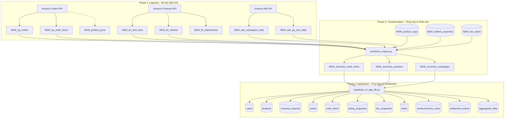

# TÀI LIỆU CHI TIẾT SƠ ĐỒ CƠ SỞ DỮ LIỆU (DATABASE SCHEMA)
## Hệ thống Sellerboard Clone (SellerVision)

Tài liệu này hệ thống hóa chi tiết toàn bộ cấu trúc các bảng (tables), views và functions trong hệ thống cơ sở dữ liệu Supabase, phân loại cụ thể theo từng Giai đoạn (**Phase**) và Phân nhóm chức năng (**Orders**, **Finances**, **Ads**).

---

## 1. Sơ đồ Luồng Dữ liệu (Data Flow Lineage)

Luồng dữ liệu di chuyển tuyến tính qua 3 giai đoạn chính của hệ thống từ các API của Amazon đến ứng dụng hiển thị đầu cuối:

---

## 2. Phần I: Các Bảng đệm & Tổng hợp (Tiền tố `NEW_`)

Toàn bộ cấu trúc bảng, index, view và function trong nhóm này được khởi tạo bởi tệp DDL duy nhất: [supabase_schema.sql](file:///C:/Users/nnh16/ads-trading-system/VPS/VPS_AMZ/sellerboard_clone/Phase2_Transformation/sql/supabase_schema.sql)

### 2.1. Nhóm Phase 1 — Ingestion (Thu thập dữ liệu thô từ Amazon API)
Lưu trữ tạm thời dữ liệu kéo trực tiếp từ Amazon API trước khi thực hiện tính toán.

#### Phân nhóm: Orders (Đơn hàng & Giá bán)
*   **`[Phase 1 - Ingestion (Orders)] NEW_sp_orders`**
    *   *Mô tả*: Lưu trữ thông tin đơn hàng thô từ Amazon SP-API. Mỗi dòng tương ứng với một đơn hàng.
    *   *Các cột chính*: `order_id` (PK), `purchase_date`, `last_update_date`, `order_status`, `fulfillment_channel`, `sales_channel`, `marketplace_id`.
*   **`[Phase 1 - Ingestion (Orders)] NEW_sp_order_items`**
    *   *Mô tả*: Chi tiết các sản phẩm trong mỗi đơn hàng (chứa liên kết khóa ngoại với `NEW_sp_orders`).
    *   *Các cột chính*: `id` (PK), `order_id` (FK), `asin`, `sku`, `title`, `quantity_ordered`, `unit_price`, `item_price` (Sales), `promotion_discount`.
*   **`[Phase 1 - Ingestion (Orders)] NEW_product_price`**
    *   *Mô tả*: Cache đơn giá gần nhất từ các đơn đã `Shipped` (hoặc nhập thủ công) để ước lượng giá bán tạm thời cho các đơn đang ở trạng thái `Pending` khi API chưa cập nhật giá.
    *   *Các cột chính*: `sku` (PK), `unit_price`, `source` ('order' / 'manual'), `updated_at`.

#### Phân nhóm: Finances (Dữ liệu tài chính - Phí & Hoàn tiền)
*   **`[Phase 1 - Ingestion (Finances)] NEW_fin_item_fees`**
    *   *Mô tả*: Lưu các khoản phí thật từ Finances API tính trên từng item (như Commission/Referral fee, FBA unit fee...).
    *   *Các cột chính*: `id` (PK), `order_id`, `posted_date`, `asin`, `sku`, `quantity`, `fee_type`, `amount`, `principal`.
*   **`[Phase 1 - Ingestion (Finances)] NEW_fin_refunds`**
    *   *Mô tả*: Theo dõi các giao dịch hoàn tiền và trả hàng từ khách để ghi nhận tổn thất và phí xử lý hoàn hàng của Amazon.
    *   *Các cột chính*: `id` (PK), `order_id`, `posted_date`, `asin`, `sku`, `quantity_returned`, `refund_principal`, `refund_commission`, `refunded_referral_fee`.
*   **`[Phase 1 - Ingestion (Finances)] NEW_fin_adjustments`**
    *   *Mô tả*: Lưu trữ các khoản tài chính điều chỉnh trực tiếp từ số dư tài khoản của Amazon.
    *   *Các cột chính*: `id` (PK), `posted_date`, `adjustment_type`, `sku`, `asin`, `quantity`, `amount`.

#### Phân nhóm: Ads (Hiệu suất quảng cáo PPC)
*   **`[Phase 1 - Ingestion (Ads)] NEW_ads_campaigns_daily`**
    *   *Mô tả*: Báo cáo quảng cáo hàng ngày cấp chiến dịch từ Ads API (SP, SB, SD reports) để lấy chi phí tổng quan.
    *   *Các cột chính*: `id` (PK), `report_date`, `campaign_id`, `campaign_name`, `ad_product`, `impressions`, `clicks`, `cost`, `sales_1d`/`7d`/`14d`.
*   **`[Phase 1 - Ingestion (Ads)] NEW_ads_sp_asin_daily`**
    *   *Mô tả*: Báo cáo quảng cáo thô chi tiết cấp SKU/ASIN dùng làm đầu vào cấp 1 phục vụ cho thuật toán phân bổ chi phí ad spend.
    *   *Các cột chính*: `id` (PK), `report_date`, `campaign_id`, `advertised_asin`, `advertised_sku`, `impressions`, `clicks`, `cost`, `units_sold_1d`.

---

### 2.2. Nhóm Phase 2 — Transformation (Tổng hợp & Tính toán chỉ số)
Các bảng chứa cấu hình do người dùng nhập và các bảng dữ liệu đã qua tổng hợp (Mart/Summary).

#### Phân nhóm: Cấu hình đầu vào (User input)
*   **`[Phase 2 - Transformation] NEW_product_cogs`**
    *   *Mô tả*: Lưu trữ giá vốn hàng hóa (COGS) do người dùng tự nhập để tính toán giá vốn theo thời gian hiệu lực và thuật toán FIFO.
    *   *Các cột chính*: `sku` (PK), `effective_date` (PK), `cog_per_unit`, `notes`, `updated_at`.
*   **`[Phase 2 - Transformation] NEW_indirect_expenses`**
    *   *Mô tả*: Chi phí gián tiếp khác của doanh nghiệp (ngoài chi phí Amazon và COGS) dùng để trừ trực tiếp khi tính lợi nhuận ròng (Net Profit).
    *   *Các cột chính*: `id` (PK), `expense_date`, `description`, `amount`.
*   **`[Phase 2 - Transformation] NEW_fee_cache`**
    *   *Mô tả*: Cấu hình phí cố định (Referral fee %, FBA fee) do user nhập đè hoặc hệ thống tự động tối ưu (calibrated) dựa trên dữ liệu phí thực tế.
    *   *Các cột chính*: `sku` (PK), `asin`, `referral_rate`, `fba_fulfillment_fee`, `product_category`, `source` ('manual' / 'calibrated'), `sample_count`.

#### Phân nhóm: Bảng tổng hợp (Summary / Mart)
*   **`[Phase 2 - Transformation] NEW_summary_order_items`**
    *   *Mô tả*: Bảng Master tổng hợp chi tiết theo từng đơn hàng (bao gồm đơn hàng bán thường và đơn hoàn tiền).
    *   *Các cột chính*: `owner_id` (FK), `order_number`, `order_date`, `asin`, `sku`, `units`, `sales`, `promo`, `amazon_fees`, `cost_of_goods` (COGS), `gross_profit`, `net_profit`, `row_type` ('normal' / 'return'), `price_source`, `fee_state`.
*   **`[Phase 2 - Transformation] NEW_summary_products`**
    *   *Mô tả*: Bảng Master tổng hợp hiệu năng và 31 chỉ số tài chính gom nhóm theo từng cặp (ASIN, SKU) trong một khoảng thời gian.
    *   *Các cột chính*: `owner_id` (FK), `period_start`, `period_end`, `asin`, `sku`, `units`, `sales`, `promo`, `ads` (chi phí ad spend phân bổ), `amazon_fees`, `cost_of_goods`, `gross_profit`, `net_profit`, `margin`, `roi`, `fee_state`.
*   **`[Phase 2 - Transformation] NEW_summary_campaigns`**
    *   *Mô tả*: Bảng tổng hợp hiệu suất và lợi nhuận ròng của từng chiến dịch quảng cáo.
    *   *Các cột chính*: `period_start`, `period_end`, `campaign_id`, `campaign_name`, `ad_spend`, `clicks`, `impressions`, `orders`, `ppc_sales`, `acos`, `profit`.

#### Phân nhóm: View & Functions (Truy vấn & Báo cáo)
*   **`[Phase 2 - Transformation] NEW_v_order_items_csv` (View)**
    *   *Mô tả*: Tái tạo cấu trúc bảng CSV báo cáo "Order Items" của Sellerboard bằng cách liên kết Orders, Items, Fees, COGS và Refunds.
*   **`[Phase 2 - Transformation] NEW_v_daily_sales_localized` (View)**
    *   *Mô tả*: Tổng hợp nhanh doanh số và số đơn bán ra theo ngày (đã bản địa hóa múi giờ Pacific).
*   **`[Phase 2 - Transformation] NEW_v_daily_refunds_localized` (View)**
    *   *Mô tả*: Tổng hợp số lượng và chi phí hoàn trả hàng theo ngày (đã bản địa hóa múi giờ Pacific).
*   **`[Phase 2 - Transformation] NEW_v_daily_fees_localized` (View)**
    *   *Mô tả*: Tổng hợp tổng phí Amazon thu theo ngày theo giờ Pacific.
*   **`[Phase 2 - Transformation] NEW_fn_daily_summary` (Function)**
    *   *Mô tả*: Hàm SQL hỗ trợ tính toán nhanh các chỉ số Dashboard (lợi nhuận gộp, lợi nhuận ròng, biên lợi nhuận, ROI...) cho một ngày cụ thể.

---

## 3. Phần II: Các Bảng ứng dụng Core (Phase 3 Application)

Toàn bộ cấu trúc các bảng trong nhóm này được khởi tạo bởi tệp: [0002_initial_app_schema.sql](file:///C:/Users/nnh16/ads-trading-system/VPS/VPS_AMZ/sellerboard_clone/backend/supabase/migrations/0002_initial_app_schema.sql) *(tương đương hệ thống migration Alembic `0001_initial_schema.py`)*.

Đây là cơ sở dữ liệu hoạt động chính của Web App thực tế nhằm phục vụ xác thực người dùng, hiển thị cấu hình sản phẩm trên giao diện, và biểu diễn biểu đồ Dashboard.

*   **`[Phase 3 - Application] users`**
    *   *Mô tả*: Quản lý tài khoản người dùng đăng nhập hệ thống.
    *   *Các cột chính*: `id` (PK), `email` (Unique), `full_name`, `hashed_password`, `is_active`, `created_at`.
*   **`[Phase 3 - Application] products`**
    *   *Mô tả*: Danh mục sản phẩm đăng ký trên web app của từng User. Quản lý thời gian nhập kho, tồn kho an toàn và URL ảnh sản phẩm.
    *   *Các cột chính*: `id` (PK), `owner_id` (FK), `asin`, `sku`, `title`, `price`, `current_stock`, `lead_time_manufacture_days`, `lead_time_shipping_days`, `image_url`.
*   **`[Phase 3 - Application] inventory_batches`**
    *   *Mô tả*: Quản lý các lô hàng nhập kho của từng sản phẩm để tính COGS FIFO.
    *   *Các cột chính*: `id` (PK), `product_id` (FK), `received_at`, `quantity`, `unit_cost`.
*   **`[Phase 3 - Application] orders`**
    *   *Mô tả*: Bảng đơn hàng cốt lõi hiển thị trên Web App.
    *   *Các cột chính*: `id` (PK), `owner_id` (FK), `external_id` (Amazon order ID), `purchased_at`, `status`, `ppc_cost`, `promo_discount`, `is_refunded`.
*   **`[Phase 3 - Application] order_items`**
    *   *Mô tả*: Chi tiết mặt hàng liên kết với bảng đơn hàng cốt lõi.
    *   *Các cột chính*: `id` (PK), `order_id` (FK), `product_id` (FK), `quantity`, `unit_price`.
*   **`[Phase 3 - Application] listing_snapshots`**
    *   *Mô tả*: Lưu trữ lịch sử snapshot thông tin listing sản phẩm theo thời gian (dữ liệu dạng JSON).
    *   *Các cột chính*: `id` (PK), `product_id` (FK), `captured_at`, `data` (JSON).
*   **`[Phase 3 - Application] bsr_snapshots`**
    *   *Mô tả*: Lưu vết biến động thứ hạng bán hàng (Best Sellers Rank) của sản phẩm.
    *   *Các cột chính*: `id` (PK), `product_id` (FK), `captured_at`, `bsr`.
*   **`[Phase 3 - Application] alerts`**
    *   *Mô tả*: Hệ thống cảnh báo tồn kho hoặc listing cho người dùng.
    *   *Các cột chính*: `id` (PK), `owner_id` (FK), `product_id` (FK), `type`, `severity`, `message`, `is_read`, `created_at`.
*   **`[Phase 3 - Application] reimbursement_cases`**
    *   *Mô tả*: Quản lý các vụ việc yêu cầu bồi thường mất mát/hỏng hóc FBA được quét tự động.
    *   *Các cột chính*: `id` (PK), `owner_id` (FK), `product_id` (FK), `reason`, `quantity`, `estimated_amount`, `status`, `detected_at`.
*   **`[Phase 3 - Application] settlement_entries`**
    *   *Mô tả*: Dữ liệu giao dịch tài chính từ báo cáo đối soát Settlement của Amazon.
    *   *Các cột chính*: `id` (PK), `owner_id` (FK), `settlement_id`, `order_id`, `transaction_type`, `amount_type`, `amount`, `posted_date`, `sku`.
*   **`[Phase 3 - Application] aggregated_daily`**
    *   *Mô tả*: Bảng KPI tổng hợp theo ngày của từng User dùng để vẽ biểu đồ và hiển thị Dashboard nhanh trên UI Web App.
    *   *Các cột chính*: `id` (PK), `owner_id` (FK), `date`, `gross_revenue`, `units_sold`, `orders_count`, `amazon_fees`, `cogs`, `ppc_cost`, `net_profit`.
*   **`[Phase 3 - Application] alembic_version`**
    *   *Mô tả*: Quản lý phiên bản database migrations để đảm bảo cấu trúc bảng ứng dụng luôn đồng bộ với mã nguồn Alembic/SQLAlchemy.
    *   *Các cột chính*: `version_num` (PK).
